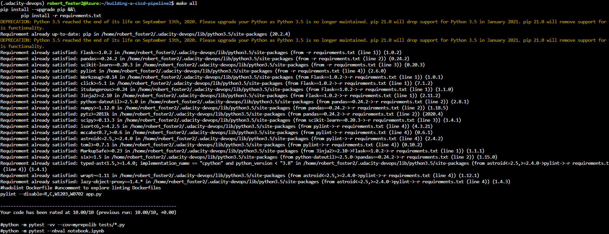

By Rob Foster

Updated 07/11/2020


# Introduction
This is my submission for the 'Building a CI/CD Pipeline' project as part of the 'DevOps Engineer for Microsoft Azure' nanodegree program from [Udacity](https://udacity.com).

It does the following:
- Creates a App Service in Azure.
- Tests code when it is pushed to GitHub.
- In Azure DevOps the code is then tested and deployed to the App Service.

See [trello](https://trello.com/b/CjgPIZxU/building-a-ci-cd-pipeline).

[Spreadsheet](project-management-template.xlsx) of project plan

Architectural diagram

Screenshots demonstrating key steps

Description on how to improve the project further

YouTube video

Screenshot showing the project cloned into Azure Cloud Shell:
 

Screenshot showing the passing tests that are displayed after running:
 

Screenshot showing the output of a test run:


# Instructions


## Create the App Service

Clone the repo:
```
git clone git@github.com:bobfoster1299/building-a-cicd-pipeline2.git
```

Change into the new directory:
```
cd building-a-cicd-pipeline2
```

Login to Azure:
```
az login
```

Create an App Service in Azure. In this example the App Service is called rob-udacity-webapp and the resource group is called rob-udacity-project:
```
az webapp up -n rob-udacity-webapp -g rob-udacity-project
```

## Create the Azure DevOps pipeline

These are the basic steps you need to follow to set up the pipeline in Azure DevOps (more information on this process can be found [here](https://docs.microsoft.com/en-us/azure/devops/pipelines/ecosystems/python-webapp?view=azure-devops&WT.mc_id=udacity_learn-wwl)):

- Go to [https://dev.azure.com](https://dev.azure.com) and sign in.
- Create a new private project.
- Under Project Settings create a new service connection to Azure Resource Manager, scoped to your subscription and resource group.
- Create a new pipeline linked to your GitHub repo.

## CI/CD

Whenever the code is updated and pushed to GitHub, the following will happen:
- GitHub Actions will test the code.
- Azure DevOps will also test the code.
- If the build is successful it will be deployed to the Azure App Service.

To test the app, edit line 28 of the make_predict_azure_app.sh script with the DNS name of your app. Then run the script:
```
./make_predict_azure_app.sh 
```

If it's working you should see the following output:
```
Port: 443
{"prediction":[20.35373177134412]}
```

You can also visit the URL, e.g. [https://rob-udacity-webapp.azurewebsites.net](https://rob-udacity-webapp.azurewebsites.net) via the browser and you should a page displaying 'Sklearn Prediction Home'.


