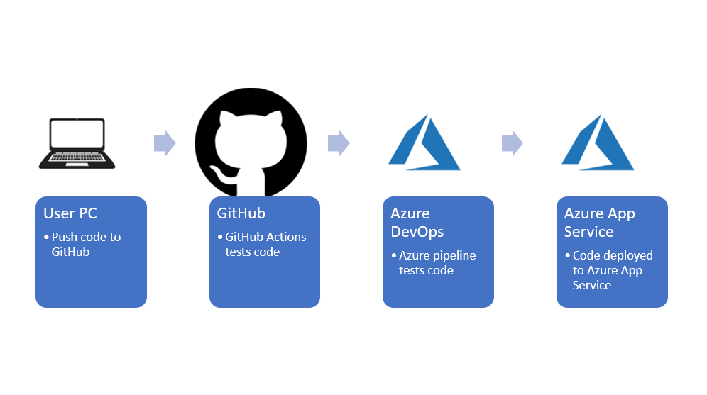

By Rob Foster

Updated 07/11/2020

# Introduction
This is my submission for the 'Building a CI/CD Pipeline' project as part of the 'DevOps Engineer for Microsoft Azure' nanodegree program from [Udacity](https://udacity.com).

This project contains a python application that is designed to predict housing prices in Boston (I did not create the python app myself). This repo will enable you to:
- Deploy the app in Azure CloudShell
- Deploy the app as an Azure App Service

Any commits to the GitHub repo trigger automated code testing using GitHub Actions. A pipeline has been created in Azure DevOps. After commiting new code to GitHub, the pipeline can test the code and deploy the new release to the Azure App Service. 

Here is an architectural diagram:


A [Trello](https://trello.com/b/CjgPIZxU/building-a-ci-cd-pipeline) board has been created to keep track of tasks to be completed.

A [spreadsheet](project-schedule.xlsx) has been created to manage the project schedule.

See [here](https://youtu.be/GQo55aCXXYo) for a YouTube video demonstrating the project.

# Instructions

## Deploy the app in Azure Cloud Shell
In Azure Cloud Shell, clone the repo:
```
git clone git@github.com:bobfoster1299/building-a-cicd-pipeline2.git
```
 

Change into the new directory:
```
cd building-a-cicd-pipeline2
```

Create a virtual environment:
```
make setup
```

Activate the virtual environment:
```
source ~/.udacity-devops/bin/activate
```

Install dependencies in the virtual environment and run tests:
```
make all
```
 

Start the application in the local environment:
```
python3 app.py
```

Open a separate Cloud Shell and test that the app is working:
```
./make_prediction.sh
```

The output should match the below:


## Deploy the app to an Azure App Service

Create an App Service in Azure. In this example the App Service is called rob-udacity-webapp and the resource group is called rob-udacity-project:
```
az webapp up -n rob-udacity-webapp -g rob-udacity-project
```

Next, create the pipeline in Azure DevOps. More information on this process can be found [here](https://docs.microsoft.com/en-us/azure/devops/pipelines/ecosystems/python-webapp?view=azure-devops&WT.mc_id=udacity_learn-wwl). The basic steps to set up the pipeline are:

- Go to [https://dev.azure.com](https://dev.azure.com) and sign in.
- Create a new private project.
- Under Project Settings create a new service connection to Azure Resource Manager, scoped to your subscription and resource group.
- Create a new pipeline linked to your GitHub repo.

Screenshot of the App Service in Azure:


Screenshot of a successful run of the project in Azure Pipelines:


To test the app running in Azure App Service, edit line 28 of the make_predict_azure_app.sh script with the DNS name of your app. Then run the script:
```
./make_predict_azure_app.sh 
```

If it's working you should see the following output:


You can also visit the URL of the App Service via the browser and you should see the following page:


View the app logs:
```
az webapp log tail -g rob-udacity-project --name rob-udacity-webapp
```


## Future improvements

Currently, when a commit is made to the GitHub repo, it does not automatically trigger a build in the Azure pipeline. In future it would be good to enable the build to trigger automatically.
